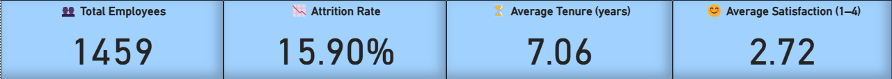
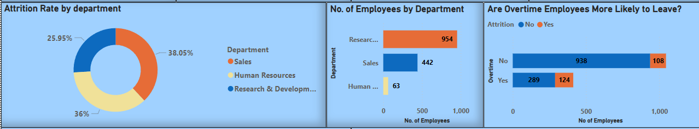
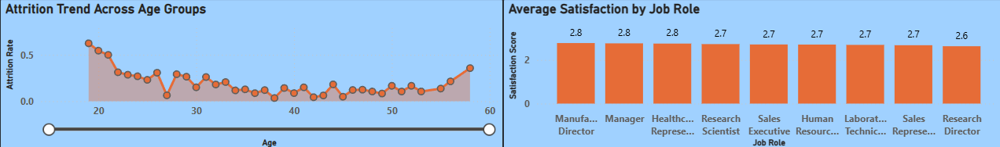

# 📊 PeoplePulse – HR Insights Dashboard

A modern, executive-ready HR analytics dashboard built in Power BI to visualize employee attrition, satisfaction, and organizational trends. This project explores key workforce metrics using interactive KPIs, department-level comparisons, and engagement indicators.

---

## 🧠 Objective

Enable business and HR leaders to:
- Understand department-wise attrition trends
- Identify roles with low engagement or satisfaction
- Compare workforce distribution and overtime impact
- Use interactive filters for slicing insights by demographics

---

## 📈 Key Features

- 📌 **Interactive KPI Cards** – Total Employees, Attrition Rate, Avg Tenure, Satisfaction Score
- 🧩 **Visual Breakdown** – Attrition by Department, Overtime, Age, and Job Role
- 🎛️ **Filters** – Department, Gender, Tenure Bucket, Education Field, Marital Status
- 📅 **Dynamic Reporting Date** – Based on system time
- 🎨 **Executive Layout** – Compact, readable, designed for business storytelling

---

## 📂 Project Structure
```
## 📁 Project Structure

peoplepulse/
├── data/                      # Datasets used in the project
│   ├── raw/                   # Original unprocessed data
│   ├── processed/             # Cleaned and feature-engineered data
│   └── WA_Fn-UseC_-HR-Employee-Attrition.csv          # CSV file
│
├── notebooks/                 # Jupyter notebooks for EDA and transformation
│   ├── EDA.ipynb/                   # Python NB with EDA steps
│   └── Feature_Engineering.ipynb/             # Python NB with feature engineering steps    
│
├── dashboard/                 # Power BI dashboard file
│   └── PeoplePulse_HR_Executive.pbix
│
├── assets/                    # Images for README and documentation
│   ├── kpi_overview.png
│   ├── trends.png
│   └── line_and_roles.png
│
└── README.md                  # Project documentation


```
---
## 📊 Visual Highlights

### KPI & Overview Section


### Workforce & Attrition Breakdown


### Trend and Satisfaction Insights


---

## 🛠 Tools Used

- **Power BI** – Interactive dashboard design & KPI metrics
- **Python (Pandas, Seaborn)** – Data wrangling, EDA
- **DAX** – KPI and conditional logic in Power BI
- **Dataset** – [IBM HR Analytics Employee Attrition Dataset](https://www.kaggle.com/datasets/pavansubhasht/ibm-hr-analytics-attrition-dataset)

---

## 💡 Key Insights

- Departments like Sales and R&D experience the most attrition
- Overtime employees are 2x more likely to leave
- Younger employees show higher churn
- Several job roles have below-average satisfaction levels (≤ 2.7)

---

## 👨‍💻 Author

**Hari Dave**  
MS Data Science | University of Arizona  
📍 [LinkedIn](https://www.linkedin.com/in/your-profile/)  
📦 [GitHub](https://github.com/your-username)

---

## 📬 Contact

If you’d like to collaborate, give feedback, or discuss HR analytics, feel free to reach out on [LinkedIn](https://www.linkedin.com/in/your-profile/).

---

> ✨ This project was created to demonstrate best practices in executive dashboarding, visual storytelling, and real-time filtering for workforce data.
