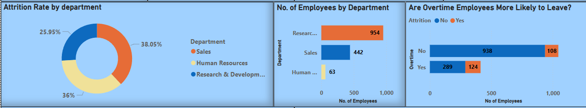
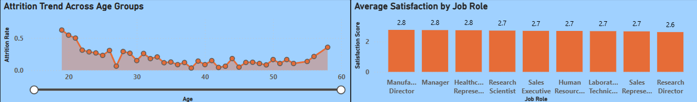

# PeoplePulse: HR Attrition & Workforce Analytics Dashboard

An end-to-end People Analytics project built to identify workforce attrition risks, 
satisfaction drivers, and organizational trends. Combines Python-based EDA and feature 
engineering with a Power BI executive dashboard designed for non-technical HR and 
business stakeholders.

---

## Overview

Organizations lose significant productivity and cost to unplanned attrition. This project 
applies a data-driven approach to the IBM HR Analytics dataset, cleaning and transforming 
raw employee records, engineering meaningful features, and surfacing insights through an 
interactive, self-service reporting model built for HR decision-makers.

The dashboard enables People teams to:
- Monitor attrition rates and spot high-risk departments, roles, and tenure bands
- Understand satisfaction and engagement patterns across the workforce
- Identify the impact of overtime, compensation, and demographics on attrition
- Slice any view dynamically by department, gender, education, and tenure

---

## Tech Stack

| Layer | Tools |
|---|---|
| Data Processing & EDA | Python, Pandas, Seaborn, Jupyter |
| Feature Engineering | Pandas, Scikit-learn |
| Dashboard & Reporting | Power BI, DAX |
| Dataset | IBM HR Analytics Employee Attrition (Kaggle) |

---

## Project Structure
```
## Project Structure

peoplepulse/
├── data/                      # Datasets used in the project
│   ├── raw/                   # Original unprocessed data
│   ├── processed/             # Cleaned and feature-engineered data
│   └── WA_Fn-UseC_-HR-Employee-Attrition.csv          # CSV file
│
├── notebooks/                 # Jupyter notebooks for EDA and transformation
│   ├── EDA.ipynb/                   # Python NB with EDA steps
│   └── Feature_Engineering.ipynb/             # Python NB with feature engineering steps    
│
├── dashboard/                 # Power BI dashboard file
│   └── PeoplePulse_HR_Executive.pbix
│
├── assets/                    # Images for README and documentation
│   ├── kpi_overview.png
│   ├── trends.png
│   └── line_and_roles.png
│
└── README.md                  # Project documentation


```
---

## Methodology

**1. Exploratory Data Analysis**
Profiled 10,000+ employee records across 35 variables. Identified class imbalance in the 
attrition label, correlation between overtime and turnover, and non-linear satisfaction 
distributions by role and department.

**2. Feature Engineering**
Created tenure buckets, satisfaction composite scores, and overtime-attrition risk flags. 
Reduced dimensionality by dropping low-variance and redundant features while preserving 
model-relevant signals.

**3. Dashboard Design**
Built a product-centric Power BI reporting model with KPI cards, dynamic cross-filters, 
and a consistent layout optimized for non-technical HR stakeholders, prioritizing 
discoverability and data trustworthiness over visual complexity.

---

## Dashboard Features

- **KPI Cards** - Headcount, Attrition Rate, Avg Tenure, Avg Satisfaction Score
- **Attrition Breakdown** - By department, job role, age band, and overtime status
- **Satisfaction Analysis** - Role-level and department-level engagement scores
- **Dynamic Filters** - Department, gender, tenure bucket, education field, marital status
- **Dynamic Report Date** - Auto-updates based on system time

---

## Key Findings

| Finding | Detail |
|---|---|
| Overtime is the strongest attrition predictor | Employees working overtime are ~2× more likely to leave |
| Sales & R&D drive the majority of attrition | Combined, they account for the largest share of departures |
| Early tenure is highest-risk | Attrition peaks in the 0–2 year band across all departments |
| Satisfaction correlates strongly with retention | Roles with avg satisfaction ≤ 2.7 show disproportionate churn |
| Younger employees churn at higher rates | Employees under 30 represent a significant portion of attrition |

---

## Visual Highlights

### KPI Overview


### Workforce & Attrition Breakdown


### Satisfaction & Role-Level Trends


---

## Author

**Hari Dave**  
MS Data Science - University of Arizona  
[LinkedIn](https://www.linkedin.com/in/hari-dave2002/) · [GitHub](https://github.com/harid0718)
